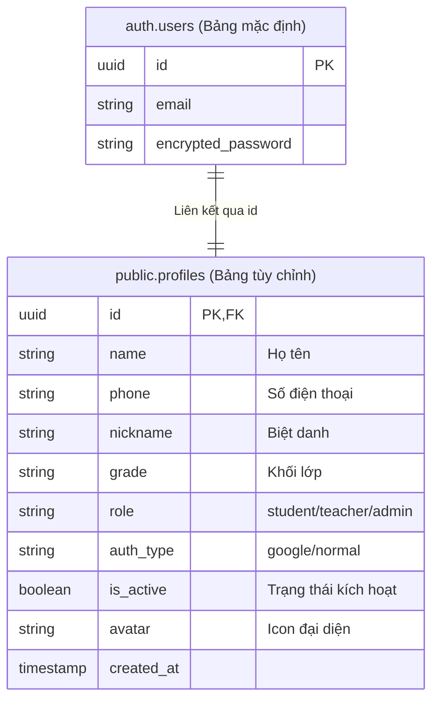

# Hướng Dẫn Thiết Lập Supabase Auth & Google OAuth 2.0 (Không sử dụng Resend)

Tài liệu này hướng dẫn chi tiết các bước thiết lập hệ thống xác thực người dùng trên **Supabase** kết hợp với **Google OAuth 2.0** cho ứng dụng VietTyping. 

Hệ thống sẽ chạy theo logic đăng ký sau:
*   **Tài khoản thường (Đăng ký qua email/mật khẩu):** Yêu cầu điền họ tên, số điện thoại, email, mật khẩu. Sau khi đăng ký, tài khoản có trạng thái mặc định là **Chờ kích hoạt** (`isActive = false`). Người dùng chỉ được trải nghiệm tối đa 3 bài học đầu và phải đợi Admin phê duyệt kích hoạt tài khoản mới có thể đăng nhập và mở khóa toàn bộ tính năng.
*   **Tài khoản Google (OAuth 2.0 thật):** Cho phép người dùng đăng nhập bằng tài khoản Google có sẵn trên trình duyệt. Tài khoản này sẽ được **tự động kích hoạt ngay lập tức** (`isActive = true`), mở khóa toàn bộ tính năng mà không cần Admin phê duyệt.

---

## PHẦN 1: CẤU HÌNH GOOGLE CLOUD CONSOLE

Để gọi danh sách các tài khoản Google đã đăng nhập trên trình duyệt của người dùng, bạn cần tạo mã ứng dụng trên Google Cloud.

### Bước 1: Tạo dự án mới
1.  Truy cập [Google Cloud Console](https://console.cloud.google.com/).
2.  Đăng nhập bằng tài khoản Google của bạn.
3.  Nhấp vào thanh chọn dự án ở góc trên bên trái > bấm **New Project** (Dự án mới).
4.  Đặt tên dự án (Ví dụ: `VietTyping-App`) và nhấn **Create** (Tạo).

### Bước 2: Cấu hình Màn hình đồng ý OAuth (OAuth consent screen)
1.  Chọn dự án vừa tạo. Tại menu bên trái, vào **APIs & Services** > **OAuth consent screen**.
2.  Chọn User Type là **External** (cho phép tất cả tài khoản Gmail đăng nhập) > bấm **Create**.
3.  Điền các thông tin bắt buộc:
    *   **App name:** `VietTyping`
    *   **User support email:** Địa chỉ email hỗ trợ của bạn.
    *   **Developer contact information:** Địa chỉ email của bạn.
4.  Bấm **Save and Continue** qua các bước Scopes và Test Users (bạn có thể thêm một vài email Gmail thử nghiệm của bạn vào mục Test Users để thử nghiệm khi ứng dụng chưa công khai).

### Bước 3: Tạo Credentials (Mã xác thực Client)
1.  Ở menu bên trái, chọn tab **Credentials**.
2.  Nhấp vào **+ Create Credentials** > chọn **OAuth client ID**.
3.  Tại phần **Application type**, chọn **Web application**.
4.  Đặt tên nhận diện (Ví dụ: `VietTyping Web client`).
5.  Cấu hình các đường dẫn URL:
    *   **Authorized JavaScript origins** (Nguồn gốc JS được phép gọi Google):
        *   `http://localhost:3000` *(dùng cho thử nghiệm ở máy cá nhân)*
        *   `https://viet-typing.vercel.app` *(địa chỉ website chạy chính thức)*
    *   **Authorized redirect URIs** (URL chuyển hướng tiếp nhận kết quả xác thực):
        *   Nhập địa chỉ Callback URL lấy từ Supabase Auth (Xem hướng dẫn ở Phần 2).
        *   *Ví dụ:* `https://[ma-du-an-supabase].supabase.co/auth/v1/callback`
6.  Bấm **Create**. Bạn sẽ nhận được **Client ID** và **Client Secret**. Hãy lưu giữ hai mã này để cấu hình vào Supabase ở bước sau.

---

## PHẦN 2: THIẾT LẬP TRÊN SUPABASE CONSOLE

Supabase cung cấp giải pháp Backend-as-a-Service trọn gói bao gồm Database PostgreSQL và module Authentication rất mạnh mẽ.

### Bước 1: Tạo dự án Supabase
1.  Truy cập [Supabase.com](https://supabase.com/) và đăng nhập.
2.  Nhấn **New Project** > chọn Tổ chức (Organization) của bạn.
3.  Nhập tên dự án (Ví dụ: `viettyping-db`), đặt mật khẩu cho Database, chọn vị trí server gần Việt Nam (Ví dụ: `Singapore - ap-southeast-1`) để tốc độ truyền tải nhanh nhất.
4.  Nhấn **Create new project** và đợi vài phút để Supabase khởi tạo hạ tầng.

### Bước 2: Kích hoạt Google Auth Provider trong Supabase
1.  Trong bảng điều khiển dự án Supabase, chọn **Authentication** ở menu bên trái > chọn **Providers** > chọn **Google**.
2.  Bật switch sang trạng thái **Enabled**.
3.  Dán mã **Client ID** và **Client Secret** (đã lấy được từ Google Cloud Console ở Phần 1) vào ô tương ứng.
4.  Sao chép dòng **Redirect URL** ở cuối ô cấu hình của Supabase (ví dụ: `https://xxxx.supabase.co/auth/v1/callback`).
5.  Quay trở lại trang cấu hình OAuth Client ID trên **Google Cloud Console**, dán đường dẫn này vào mục **Authorized redirect URIs** đã đề cập ở Phần 1, sau đó nhấn **Save**.

### Bước 3: Tắt tính năng Email Confirmation (Xác nhận Email)
Vì chúng ta **bỏ qua việc gửi email kích hoạt qua Resend hoặc Supabase**, người dùng đăng ký tài khoản thường sẽ được lưu thẳng vào database mà không cần click link xác thực email:
1.  Trong mục **Authentication** > chọn **Configuration** > chọn **Email Templates** hoặc **Providers** > **Email**.
2.  Tắt tùy chọn **Confirm email** (hoặc *Double Opt-In*) để tài khoản thường sau khi đăng ký có thể được lưu ngay dưới dạng chờ Admin duyệt (không cần gửi email xác nhận nữa).

---

## PHẦN 3: THIẾT KẾ CƠ SỞ DỮ LIỆU (DATABASE SCHEMA) VÀ TRIGGER TỰ ĐỘNG

Thông tin đăng nhập cốt lõi (Email, Mật khẩu, ID) được Supabase quản lý tự động trong schema nội bộ `auth.users`. Để lưu trữ thêm các trường tùy chỉnh như Họ tên, Số điện thoại, Biệt danh, Khối lớp, Ảnh đại diện, và đặc biệt là **Trạng thái kích hoạt (isActive)**, chúng ta cần tạo một bảng trung gian tên là `profiles` trong schema công khai `public`.



### Bước 1: Tạo bảng `profiles`
Truy cập **SQL Editor** trên Supabase Dashboard và chạy đoạn lệnh SQL sau để tạo bảng `profiles`:

```sql
-- 1. Tạo bảng profiles lưu thông tin hồ sơ bổ sung
CREATE TABLE public.profiles (
  id UUID REFERENCES auth.users ON DELETE CASCADE PRIMARY KEY,
  name TEXT NOT NULL,
  phone TEXT,
  nickname TEXT,
  grade TEXT DEFAULT 'Lớp 6',
  role TEXT DEFAULT 'student' CHECK (role IN ('student', 'teacher', 'admin')),
  auth_type TEXT NOT NULL CHECK (auth_type IN ('google', 'normal')),
  is_active BOOLEAN DEFAULT FALSE,
  avatar TEXT DEFAULT '🦊',
  created_at TIMESTAMP WITH TIME ZONE DEFAULT TIMEZONE('utc'::text, NOW()) NOT NULL
);

-- Bật tính năng Row Level Security (RLS) để bảo vệ dữ liệu
ALTER TABLE public.profiles ENABLE ROW LEVEL SECURITY;

-- Tạo chính sách (Policies) truy cập dữ liệu
CREATE POLICY "Cho phép mọi người đọc hồ sơ của nhau" 
  ON public.profiles FOR SELECT USING (true);

CREATE POLICY "Người dùng chỉ được cập nhật hồ sơ cá nhân" 
  ON public.profiles FOR UPDATE USING (auth.uid() = id);
```

### Bước 2: Tạo Trigger tự động đồng bộ tài khoản Google
Khi người dùng đăng nhập bằng Google lần đầu tiên, Supabase sẽ tự động tạo một tài khoản trong `auth.users`. Đoạn Trigger dưới đây sẽ tự động bắt sự kiện đó để chèn thông tin tương ứng vào bảng `public.profiles` với giá trị `is_active = true` (Tự động kích hoạt không cần duyệt).

Đối với tài khoản thường (đăng ký bằng form), chúng ta sẽ tự ghi trực tiếp thông tin từ Client hoặc Backend với giá trị `is_active = false` (chờ duyệt).

Chạy đoạn SQL này trong **SQL Editor**:

```sql
-- Tạo hàm xử lý khi có tài khoản mới được tạo
CREATE OR REPLACE FUNCTION public.handle_new_user()
RETURNS TRIGGER AS $$
DECLARE
  v_name TEXT;
  v_avatar TEXT;
  v_auth_type TEXT;
  v_is_active BOOLEAN;
BEGIN
  -- Kiểm tra xem người dùng đăng nhập bằng nhà cung cấp nào
  IF NEW.raw_app_meta_data->>'provider' = 'google' THEN
    v_name := COALESCE(NEW.raw_user_meta_data->>'full_name', NEW.raw_user_meta_data->>'name', split_part(NEW.email, '@', 1));
    v_avatar := COALESCE(NEW.raw_user_meta_data->>'avatar_url', '🦊');
    v_auth_type := 'google';
    v_is_active := TRUE; -- TỰ ĐỘNG MỞ KHÓA CHO GOOGLE AUTH
  ELSE
    -- Đối với đăng ký thường, dữ liệu được ghi tay từ frontend/API nên ta không cần ghi đè ở trigger này
    RETURN NEW;
  END IF;

  -- Ghi thông tin tài khoản Google vào bảng profiles
  INSERT INTO public.profiles (id, name, phone, nickname, grade, role, auth_type, is_active, avatar)
  VALUES (
    NEW.id,
    v_name,
    '', -- Tài khoản google không có sẵn số điện thoại
    split_part(NEW.email, '@', 1), -- Biệt danh mặc định lấy từ phần trước @ của email
    'Lớp 6',
    'student',
    v_auth_type,
    v_is_active,
    v_avatar
  )
  ON CONFLICT (id) DO UPDATE
  SET 
    name = EXCLUDED.name,
    avatar = EXCLUDED.avatar;

  RETURN NEW;
END;
$$ LANGUAGE plpgsql SECURITY DEFINER;

-- Gán hàm xử lý trên vào Trigger của bảng auth.users
CREATE OR REPLACE TRIGGER on_auth_user_created
  AFTER INSERT ON auth.users
  FOR EACH ROW EXECUTE FUNCTION public.handle_new_user();
```

---

## PHẦN 4: KẾT NỐI VÀ XỬ LÝ TRONG MÃ NGUỒN NEXT.JS

### Bước 1: Cài đặt thư viện Supabase Client
Chạy lệnh cài đặt thư viện chính thức tại thư mục dự án:
```bash
npm install @supabase/supabase-js
```

### Bước 2: Thiết lập file môi trường `.env.local`
Tạo/Cập nhật file `.env.local` ở thư mục gốc của dự án (đã được cấu hình trong `.gitignore` để không bị lộ lên GitHub):
```bash
# Lấy từ Project Settings > API trên Supabase Dashboard
NEXT_PUBLIC_SUPABASE_URL="https://[ma-du-an-cua-ban].supabase.co"
NEXT_PUBLIC_SUPABASE_ANON_KEY="eyJhbGciOi..."
```

### Bước 3: Khởi tạo Supabase Client
Tạo file `src/lib/supabase.ts`:
```typescript
import { createClient } from '@supabase/supabase-js';

const supabaseUrl = process.env.NEXT_PUBLIC_SUPABASE_URL!;
const supabaseAnonKey = process.env.NEXT_PUBLIC_SUPABASE_ANON_KEY!;

export const supabase = createClient(supabaseUrl, supabaseAnonKey);
```

### Bước 4: Viết hàm đăng ký và đăng nhập trong Context/Auth Service

#### 1. Đăng ký tài khoản thường (Normal Signup):
```typescript
import { supabase } from '@/lib/supabase';

export const signupNormal = async (userData: {
  name: string;
  phone: string;
  email: string;
  password: string;
}) => {
  // 1. Tạo tài khoản đăng nhập trong auth.users của Supabase
  const { data: authData, error: authError } = await supabase.auth.signUp({
    email: userData.email,
    password: userData.password,
  });

  if (authError) {
    return { success: false, error: authError.message };
  }

  if (!authData.user) {
    return { success: false, error: "Đăng ký không thành công, vui lòng thử lại." };
  }

  // 2. Tự chèn thủ công thông tin hồ sơ kèm số điện thoại và đặt is_active = FALSE (chờ duyệt)
  const { error: profileError } = await supabase.from('profiles').insert([
    {
      id: authData.user.id,
      name: userData.name,
      phone: userData.phone,
      nickname: userData.email.split('@')[0],
      grade: 'Lớp 6',
      role: 'student',
      auth_type: 'normal',
      is_active: false, // YÊU CẦU ADMIN DUYỆT ĐỂ MỞ KHÓA
      avatar: '🦊',
    }
  ]);

  if (profileError) {
    console.error("Lỗi tạo profile:", profileError.message);
    // Hủy tài khoản auth nếu tạo profile thất bại để tránh rác database
    await supabase.auth.signOut();
    return { success: false, error: "Có lỗi khi lưu thông tin hồ sơ bổ sung!" };
  }

  return { success: true, message: "Đăng ký thành công! Vui lòng chờ Giáo viên hoặc Admin duyệt để đăng nhập." };
};
```

#### 2. Đăng nhập tài khoản thường và Kiểm tra kích hoạt:
Khi người dùng đăng nhập tài khoản thường, hệ thống cần chặn lại nếu Admin chưa duyệt kích hoạt (`is_active = false`).
```typescript
export const loginNormal = async (email: string, password: string) => {
  // 1. Đăng nhập bằng tài khoản email/mật khẩu thông thường
  const { data: authData, error: authError } = await supabase.auth.signInWithPassword({
    email,
    password,
  });

  if (authError) {
    return { success: false, error: authError.message };
  }

  const userId = authData.user?.id;

  // 2. Truy vấn thông tin kích hoạt trong bảng profiles
  const { data: profile, error: profileError } = await supabase
    .from('profiles')
    .select('*')
    .eq('id', userId)
    .single();

  if (profileError || !profile) {
    await supabase.auth.signOut();
    return { success: false, error: "Không tìm thấy hồ sơ người dùng!" };
  }

  // 3. Kiểm tra trạng thái phê duyệt của Admin
  if (!profile.is_active) {
    await supabase.auth.signOut(); // Đăng xuất ra ngay lập tức
    return { success: false, error: "Tài khoản của bạn đang chờ phê duyệt. Vui lòng liên hệ Admin để được kích hoạt!" };
  }

  return { success: true, user: { ...authData.user, ...profile } };
};
```

#### 3. Đăng nhập/Đăng ký bằng Google Auth thật (Gọi tài khoản trình duyệt):
```typescript
export const loginWithGoogleReal = async () => {
  const { error } = await supabase.auth.signInWithOAuth({
    provider: 'google',
    options: {
      redirectTo: `${window.location.origin}/typing`,
      queryParams: {
        access_type: 'offline',
        prompt: 'select_account', // Yêu cầu hiển thị bảng chọn các tài khoản Google đã đăng nhập sẵn trên trình duyệt
      },
    },
  });

  if (error) {
    return { success: false, error: error.message };
  }

  // Quá trình đăng nhập Google sẽ chuyển hướng người dùng sang trang Google để chọn tài khoản,
  // sau đó Google trả về kết quả cho Supabase. Trigger tự động của Supabase sẽ thêm dữ liệu
  // vào bảng profiles với is_active = TRUE và chuyển hướng thẳng học sinh về trang luyện gõ.
  return { success: true };
};
```

---

## PHẦN 5: GIAO DIỆN QUẢN TRỊ ADMIN PHÊ DUYỆT TÀI KHOẢN

Trong phần quản lý danh sách tài khoản của Giáo viên/Quản trị viên, bạn chỉ cần thực hiện thao tác cập nhật cột `is_active` thành `TRUE` để mở khóa hoàn toàn tài khoản thường:

```typescript
export const adminApproveUser = async (studentId: string) => {
  const { data, error } = await supabase
    .from('profiles')
    .update({ is_active: true })
    .eq('id', studentId);

  if (error) {
    return { success: false, error: error.message };
  }
  return { success: true };
};
```
