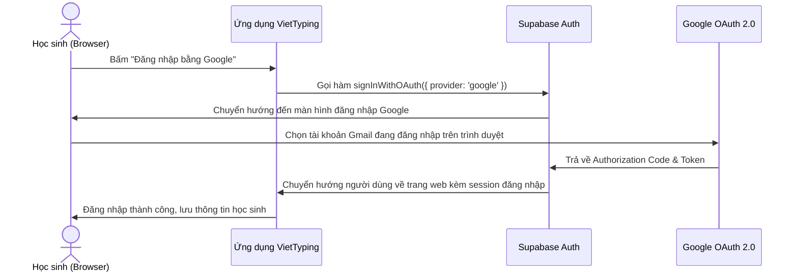

# Hướng Dẫn Tích Hợp Xác Thực Google OAuth 2.0 & Cấu Hình Email Resend

Tài liệu này giải đáp chi tiết các câu hỏi của bạn về việc tích hợp **Google OAuth 2.0 thật** (gọi các tài khoản đã đăng nhập trên trình duyệt), cách thiết lập **Resend Email**, và tính hợp lệ của tên miền **`https://viet-typing.vercel.app`**.

---

## 1. TÊN MIỀN `viet-typing.vercel.app` CÓ HỢP LỆ ĐỂ CẤU HÌNH RESEND KHÔNG?

> [!WARNING]
> **Câu trả lời là: KHÔNG HỢP LỆ để cấu hình Tên miền gửi Email (Sending Domains) chính thức.**

### Lý do:
Để gửi email bằng tên miền riêng (ví dụ: `admin@viettyping.edu.vn`), các nhà cung cấp dịch vụ email như **Resend**, **SendGrid**, hay **Mailgun** yêu cầu bạn phải **xác minh quyền sở hữu tên miền** bằng cách cấu hình các bản ghi DNS sau trong trang quản trị tên miền của bạn:
*   **Bản ghi TXT (SPF & DKIM):** Để xác thực Resend được phép gửi thư thay mặt tên miền của bạn (tránh rơi vào hộp thư rác/Spam).
*   **Bản ghi MX:** Để xử lý luồng nhận thư hoặc xác minh.
*   **Bản ghi CNAME:** Để theo dõi lượt mở, nhấp vào liên kết (nếu cần).

Vì `vercel.app` là tên miền phụ (subdomain) dùng chung do **Vercel** sở hữu và quản lý, bạn **không có quyền cấu hình bản ghi DNS** cho tên miền này. Do đó, bạn không thể thêm `viet-typing.vercel.app` vào mục **Domains** trên Resend.

### Giải pháp khắc phục:

1.  **Mua tên miền riêng (Khuyên dùng cho sản phẩm thực tế):**
    *   Mua một tên miền giá rẻ từ các nhà cung cấp như Hostinger, Namecheap, GoDaddy, Mắt Bão, Nhân Hòa (ví dụ: `viettyping.com`, `viet-typing.vn`, `viettyping.edu.vn`).
    *   Trỏ tên miền đó về dự án Vercel của bạn (Vercel hỗ trợ cấu hình tên miền tùy chỉnh miễn phí và rất nhanh).
    *   Sử dụng tên miền này để khai báo trên Resend và cấu hình các bản ghi DNS theo hướng dẫn của Resend.
2.  **Sử dụng tên miền mặc định của Resend để thử nghiệm (Miễn phí):**
    *   Mặc định khi tạo tài khoản, Resend cấp cho bạn một địa chỉ gửi thư thử nghiệm là `onboarding@resend.dev`.
    *   **Giới hạn:** Bạn chỉ có thể gửi email từ địa chỉ này đến **chính email mà bạn đã dùng để đăng ký tài khoản Resend** (Email của bạn - Admin). Nếu gửi đến email của học sinh khác, email sẽ bị chặn.

---

## 2. HƯỚNG DẪN CHI TIẾT CẤU HÌNH GOOGLE OAUTH 2.0 (GOOGLE CLOUD CONSOLE)

Khi người dùng bấm "Đăng ký/Đăng nhập bằng Google", hệ thống sẽ chuyển hướng sang Google để gọi danh sách tài khoản đã đăng nhập sẵn trên trình duyệt.

### Bước 1: Tạo thông tin xác thực trên Google Cloud Console
1.  Truy cập [Google Cloud Console](https://console.cloud.google.com/).
2.  Tạo một dự án mới (ví dụ: `VietTyping`).
3.  Vào menu **APIs & Services** > **OAuth consent screen** (Màn hình đồng ý OAuth):
    *   Chọn **User Type** là **External** (để mọi tài khoản gmail đều có thể đăng nhập).
    *   Điền thông tin ứng dụng: Tên ứng dụng (`VietTyping`), Email hỗ trợ, và Email nhà phát triển.
    *   Nhấn **Save and Continue** qua các bước Scopes và Test Users.
4.  Vào mục **Credentials** (Thông tin xác thực):
    *   Nhấn **+ Create Credentials** > chọn **OAuth client ID**.
    *   Chọn **Application type** là **Web application**.
    *   Đặt tên gợi nhớ (ví dụ: `VietTyping Production`).

### Bước 2: Cấu hình Redirect URIs và Origins (QUAN TRỌNG)
Trong phần cài đặt OAuth Client ID ở trên, bạn phải điền chính xác thông tin tên miền của mình:

1.  **Authorized JavaScript origins** (Nguồn gốc JavaScript được phép):
    *   `http://localhost:3000` *(để chạy thử ở máy cá nhân)*
    *   `https://viet-typing.vercel.app` *(địa chỉ trang web chạy thực tế của bạn)*
2.  **Authorized redirect URIs** (Đường dẫn tiếp nhận kết quả đăng nhập sau khi xác thực):
    *   **Nếu bạn dùng Supabase Auth (Khuyên dùng):**
        Copy địa chỉ Callback URL từ trang quản trị Supabase của bạn (Auth > Providers > Google). Nó sẽ có dạng:
        `https://[project-ref-id].supabase.co/auth/v1/callback`
    *   **Nếu bạn dùng NextAuth.js (Auth.js):**
        `http://localhost:3000/api/auth/callback/google`
        `https://viet-typing.vercel.app/api/auth/callback/google`

*Bấm **Create** để nhận **Client ID** và **Client Secret**.*

---

## 3. HƯỚNG DẪN CẤU HÌNH GOOGLE GOOGLE OAUTH VÀO HỆ THỐNG SUPABASE

Nếu bạn tích hợp hệ thống lưu trữ qua **Supabase**, việc liên kết Google Auth vô cùng đơn giản:



### Các bước cấu hình trên Supabase:
1.  Truy cập vào trang quản trị **Supabase Dashboard** của bạn.
2.  Chọn dự án của bạn và di chuyển đến **Authentication** > **Providers** > **Google**.
3.  Bật (Enable) nhà cung cấp Google.
4.  Dán **Client ID** và **Client Secret** lấy từ Google Cloud Console ở mục 2 vào.
5.  Sao chép dòng **Redirect URL** ở cuối khung cấu hình đó và quay lại dán vào mục **Authorized redirect URIs** trên Google Cloud Console.
6.  Lưu lại cấu hình trên cả hai trang.

### Code gọi Google Auth thật trong React/Next.js:
Để kích hoạt đăng nhập bằng tài khoản Google thật, bạn chỉ cần thay thế hàm giả lập bằng code gọi thư viện Supabase:

```typescript
import { createClient } from '@supabase/supabase-js';

const supabase = createClient(
  process.env.NEXT_PUBLIC_SUPABASE_URL!,
  process.env.NEXT_PUBLIC_SUPABASE_ANON_KEY!
);

export const loginWithGoogleReal = async () => {
  const { data, error } = await supabase.auth.signInWithOAuth({
    provider: 'google',
    options: {
      redirectTo: `${window.location.origin}/typing`, // Trang chuyển hướng sau khi đăng nhập thành công
      queryParams: {
        access_type: 'offline',
        prompt: 'select_account', // Bắt buộc Google hiển thị danh sách tài khoản đã đăng nhập trên trình duyệt để chọn
      },
    },
  });
  
  if (error) {
    console.error("Lỗi đăng nhập Google:", error.message);
    return { success: false, error: error.message };
  }
  return { success: true };
};
```

---

## 4. HƯỚNG DẪN CHI TIẾT CẤU HÌNH VÀ SỬ DỤNG RESEND EMAIL

### Bước 1: Lấy API Key từ Resend
1.  Truy cập [Resend.com](https://resend.com/) và đăng ký tài khoản.
2.  Vào mục **API Keys** > chọn **Create API Key**.
3.  Đặt tên (Ví dụ: `VietTyping-Email-Service`) và chọn quyền **Full Access**.
4.  Sao chép chuỗi API Key được hiển thị (chuỗi bắt đầu bằng `re_...`).

### Bước 2: Khai báo DNS trên Resend (Nếu có tên miền riêng)
1.  Vào mục **Domains** trên Resend > chọn **Add Domain**.
2.  Nhập tên miền của bạn (ví dụ: `viettyping.vn`) và chọn khu vực (Region).
3.  Resend sẽ hiển thị danh sách các bản ghi DNS. Bạn hãy đăng nhập vào nơi bạn mua tên miền và thêm các bản ghi này vào cấu hình DNS:
    *   **Bản ghi TXT thứ nhất (DKIM):** Tên bản ghi, giá trị bản ghi theo mẫu của Resend.
    *   **Bản ghi TXT thứ hai (SPF):** `v=spf1 include:amazonses.com ~all` (hoặc giá trị Resend cấp).
    *   **Bản ghi MX (nếu có):** Nhận diện máy chủ nhận thư của Resend.
4.  Sau khi thêm xong trên trang quản trị tên miền, bấm **Verify** trên Resend. Khi trạng thái chuyển sang màu xanh lá cây (**Verified**), bạn đã có thể gửi email chính thức từ địa chỉ email theo tên miền của mình (ví dụ: `hoc-tap@viettyping.vn`).

### Bước 3: Triển khai API Route gửi Email trong Next.js

1.  Cài đặt thư viện:
    ```bash
    npm install resend
    ```
2.  Thêm biến môi trường vào file `.env.local` ở thư mục gốc dự án:
    ```bash
    RESEND_API_KEY="re_chuoi-api-key-cua-ban"
    ```
3.  Viết API gửi mail ở file `src/app/api/send-email/route.ts`:
    ```typescript
    import { NextResponse } from 'next/server';
    import { Resend } from 'resend';

    const resend = new Resend(process.env.RESEND_API_KEY);

    export async function POST(request: Request) {
      try {
        const { email, name, subject, contentHtml } = await request.json();

        // Nếu dùng tên miền onboarding thử nghiệm của Resend
        // và bạn chưa xác thực tên miền riêng, thì địa chỉ 'from' phải là:
        // 'onboarding@resend.dev' và 'to' chỉ gửi được cho chính email đăng ký Resend của bạn.
        const sender = process.env.NODE_ENV === 'production' && process.env.VERIFIED_DOMAIN
          ? `VietTyping <no-reply@${process.env.VERIFIED_DOMAIN}>`
          : 'VietTyping Test <onboarding@resend.dev>';

        const data = await resend.emails.send({
          from: sender,
          to: [email],
          subject: subject || 'Thông báo từ hệ thống VietTyping 🚀',
          html: contentHtml || `<p>Xin chào ${name}, chúc bạn học tập tốt!</p>`,
        });

        return NextResponse.json({ success: true, data });
      } catch (error: any) {
        return NextResponse.json({ success: false, error: error.message }, { status: 500 });
      }
    }
    ```

---

## 5. TỔNG KẾT LUỒNG ĐĂNG KÝ HỌC SINH SAU KHI ĐÃ CẤU HÌNH THÀNH CÔNG

Sau khi hoàn thiện tích hợp, hệ thống của bạn sẽ chạy theo luồng logic chuẩn sau:

| Loại Tài Khoản | Đăng Ký & Xác Thực | Trạng Thế Ban Đầu | Quyền Hạn Đổi Hồ Sơ |
| :--- | :--- | :--- | :--- |
| **Google Auth (Thật)** | Chọn tài khoản Gmail đang lưu trên trình duyệt qua popup Google. | **Kích hoạt ngay lập tức** | Cho phép đổi Avatar, Biệt danh, Họ tên, Lớp, Số điện thoại, Email. Dữ liệu đồng bộ Supabase & Google Sheets. |
| **Tài Khoản Thường** | Điền Họ tên, SĐT, Email, Mật khẩu. Hệ thống gửi Email thông báo/yêu cầu kích hoạt qua Resend. | **Chờ duyệt (Pending)** (Không thể đăng nhập cho đến khi Admin phê duyệt) | Sau khi được Admin bật **isActive**, cho phép đăng nhập và đổi Avatar, Biệt danh, Họ tên, Lớp, Số điện thoại, Email. |
